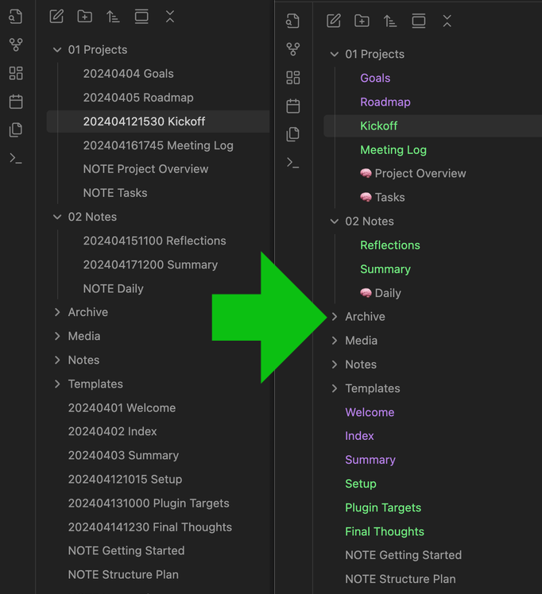

# FileName Styler

**FileName Styler** is a plugin for [Obsidian](https://obsidian.md) that allows you to hide, modify, and decorate parts of file names in the sidebar based on patterns or folder locations.

Originally created as simple “Zettelkasten ID Hider,” this plugin has evolved into a flexible tool for styling file names based on regex or timestamp-based IDs.

✨ **Special thanks to Simon for the original idea and inspiration behind this plugin.**

---

## Features

- Hide timestamp-based IDs (8-, 12-, or 14-digit) from file names
- Support for **custom regular expressions** with 3 capture groups
- Add custom **prefixes** and **suffixes** to matching file names
- Apply **custom colors** and **custom file icons** (e.g. 🧠 or 📖)
- Restrict styling to specific folders only
- Combine multiple styling **profiles** – different styles for different folders or file types
- Automatically restore original file names and styles when unloading

---

## Preview

Here’s a quick before/after look at how file names appear with and without styling enabled:



---


## How it works

This plugin searches for matching file names based on selected ID formats:

- `yyyyMMddHHmmss` → 14-digit
- `yyMMddHHmmss`   → 12-digit
- `yyyyMMdd`       → 8-digit
- or a **custom regular expression**, such as:

  ```regex
  ^(\d{6})([-_ ]?)(.+)$
  ```

It then applies the configured styling to each match within the File Explorer (without changing the actual file name on disk).

---

## Settings

You can configure and combine **multiple profiles**. Each profile supports:

- **ID format** – Choose from predefined timestamp formats or define your own regex
- **Move ID to end** – Display the ID at the end of the file name instead of the start
- **Custom prefix** – Text to prepend to the displayed name
- **Custom suffix** – Text to append to the displayed name
- **Custom text color** – Optional color override
- **Custom icon** – Emoji or Unicode (e.g. `🧠`, `📖`)
- **Folder filter** – Apply profile only in certain folders

All profiles can be toggled independently and are applied in order.

---

## Installation

1. Download or clone this repository.
2. Copy the following files into your Obsidian vault under:

   ```
   .obsidian/plugins/filename-styler/
   ```

   Required files:
   - `main.js`
   - `manifest.json`
   - (optional) `styles.css`

3. Enable the plugin in Obsidian under
   `Settings → Community Plugins`.

---

## Compatibility

Compatible with Obsidian v1.8.9 and higher.
Earlier versions might also work, but have not been tested.

---

## License

MIT License.

---

**Created with ❤️ by and for the Obsidian community.**
